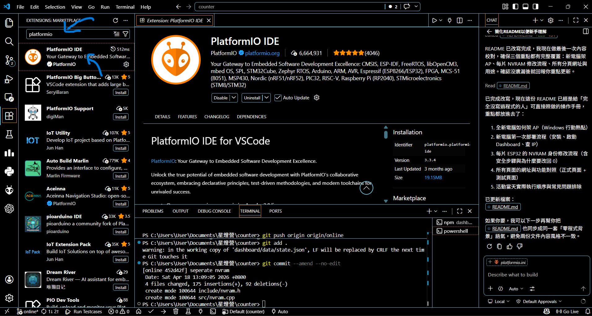
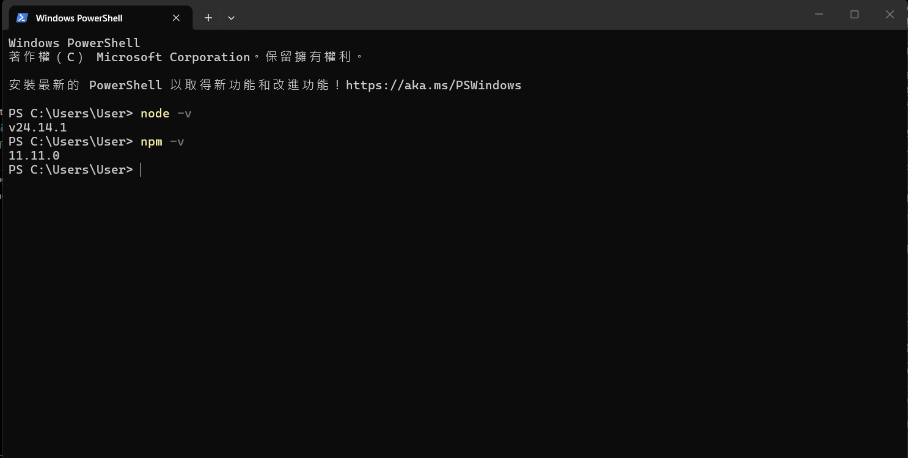

# 星燈營 Counter 操作手冊


---

## 1. 這套系統是做什麼的

這個專案有兩個部分：

1. 電腦上的中央網站（Dashboard）
用途：給管理員看全場狀態、給各桌長加減人數。

2. 每桌一片 ESP32（硬體）
用途：讀感測器、點燈、把桌次資料回傳到中央網站。

---

## 2. 全新電腦第一次架設（重點：接外部 Router）

這一段是你最重要的流程。
目標是讓新電腦同時做到兩件事：

1. 讓 Router 提供 Wi-Fi（AP）給 ESP32、手機、電腦連線。
2. 在這台電腦上跑 Dashboard 伺服器。

### 2-1. 先安裝必備軟體

請先安裝：

1. Node.js（LTS 版本）
https://nodejs.org/en/download
2. VS Code
https://code.visualstudio.com/download
3. VS Code 的 PlatformIO 擴充套件


安裝 Node.js 後，開 PowerShell 檢查：

```powershell
node -v
npm -v
```


正確安裝顯示(版本號不同沒關係)

### 2-2. 設定 Router 的 Wi-Fi（AP）

1. 先把 Router 開好，確認可以正常發 Wi-Fi。
2. 設定 Router 的 Wi-Fi 名稱（SSID）與密碼。
3. 讓主控電腦、手機、所有 ESP32 都連到同一台 Router。

本專案目前韌體預設是：

- Wi-Fi 名稱（SSID）：`counter`
- Wi-Fi 密碼：`88888888`

所以你有兩種做法：

1. 最省事：把 Router Wi-Fi 設成 `counter / 88888888`。
2. 你要自訂：那就要一起改 ESP32 韌體裡的 Wi-Fi 設定（第 4 章會教）。

### 2-3. 查這台電腦的 IP（ESP32 會用到）

在 PowerShell 輸入：

```powershell
ipconfig
```

找到連到 Router 的那張網卡 IPv4 位址，例如 `192.168.66.101`。

這個 IP 很重要，因為 ESP32 要把資料送到：

`http://你的電腦IP:3000`

例如：`http://192.168.66.101:3000`

---

## 3. 啟動中央網站（Dashboard）

在專案資料夾執行：

```powershell
cd dashboard
npm install
npm start
```

看到類似訊息代表成功：

- Dashboard server running at http://localhost:3000/client
- Hidden admin route: http://localhost:3000/admin-J2E13412

停止伺服器：在同一個終端機按 `Ctrl + C`。

---

## 4. 每片 ESP32 要改的地方（Wi-Fi + NVRAM）

這章分兩個層次：

1. 先改「連線設定」（所有板子都一樣）
2. 再改「每片身份」（每片都不同）

### 4-1. 改 ESP32 連線設定（所有板子共用）

打開 `src/main.cpp`，確認這 4 個常數：

- `WIFI_SSID`
- `WIFI_PASSWORD`
- `SERVER_BASE_URL`
- `MQTT_BROKER`

你要確保：

1. `WIFI_SSID` / `WIFI_PASSWORD` 跟你 AP 完全一致。
2. `SERVER_BASE_URL` 是你的電腦 IP，不可用 `localhost`。
3. 如果沒在用 MQTT，可先維持現況；有用 MQTT 時要填可連到的 broker IP。

目前專案預設值是：

- SSID: `counter`
- Password: `88888888`
- Server: `http://192.168.66.101:3000`
- MQTT Broker: `192.168.66.101`

### 4-2. 改每片板子的 NVRAM 身份（重點）

打開 `src/nvram.cpp`，你會看到兩個開關：

1. `FIXED_TABLE_NUMBER`
用途：指定這片板子是第幾桌。

2. `FORCE_RESET_NVRAM`
用途：強制清空舊身份，寫入新身份。

#### 最安全的單片流程（每片都照這樣做）

假設你現在要把這片板子設成第 7 桌：

1. 把 `FIXED_TABLE_NUMBER` 改成 `7`。
2. 把 `FORCE_RESET_NVRAM` 改成 `1`。
3. 上傳一次韌體（Upload）。
4. 看序列埠輸出，應該會看到 `team-7`、`esp32-table-7`。
5. 馬上把 `FORCE_RESET_NVRAM` 改回 `0`。
6. 再上傳一次（避免每次開機都清空 NVRAM）。

#### 為什麼一定要改回 0

如果一直維持 `FORCE_RESET_NVRAM = 1`，每次重開機都會重寫快閃記憶體，長期會增加損耗。

#### 20 片板子快速對照

- 第 1 桌：`FIXED_TABLE_NUMBER = 1`
- 第 2 桌：`FIXED_TABLE_NUMBER = 2`
- ...
- 第 20 桌：`FIXED_TABLE_NUMBER = 20`

身份會自動變成：

- `team-桌號`
- `esp32-table-桌號`

---

## 5. 每個分頁的網址與功能（完整表）

先定義兩種網址基底：

1. 本機看（同一台電腦）：`http://127.0.0.1:3000`
2. 區網看（手機/平板/其他電腦/ESP32）：`http://你的電腦IP:3000`

以下路徑都接在這兩個基底後面。

### 5-1. 正式使用頁面

1. `/client`
功能：桌長操作頁。先選桌次，再按 +1 / -1。

2. `/admin-J2E13412`
功能：管理員頁。可切模式、看設備在線、設各桌上限、全部歸零。

3. `/leaderboard`
功能：排行榜獨立頁（主要給計分模式使用）。

4. `/star_night`
功能：星空牆顯示頁。會把全場進度可視化。

5. `/`
功能：自動跳轉到 `/client`。

### 5-2. 測試工具頁

1. `/test-J2E13412`
功能：測試中心入口。

2. `/test-J2E13412/star-test`
功能：夜空測試。會自動切到圓滿餐會模式，並模擬各桌數據變化。

3. `/test-J2E13412/brightness-test`
功能：遠端燈光測試。可選在線裝置，下發顏色/亮度/呼吸參數。

### 5-3. Admin 網址如何改

如果你不想用 `admin-J2E13412`，啟動前設定：

```powershell
$env:ADMIN_PATH_SEGMENT = "admin-自訂密碼"
npm start
```

之後 admin 會變成：`/admin-自訂密碼`。

---

## 6. 活動當天建議流程（照著做）

1. 開 Router，確認 Wi-Fi 名稱/密碼正確，且主機與 ESP32 都連上同一網段。
2. 在電腦啟動 Dashboard（`cd dashboard` -> `npm start`）。
3. 在 admin 頁確認模式（計分 or 圓滿餐會）。
4. 逐片上電 ESP32，確認 admin 顯示設備在線。
5. 讓桌長進入 client 頁操作。
6. 需要大螢幕顯示就開 leaderboard 或 star_night。

---

## 7. 新手常見問題

### Q1. 手機打不開頁面

請檢查：

1. 手機和主機是否在同一網路（同一 AP）。
2. 你是否使用 `你的電腦IP:3000`，而不是 `localhost`。
3. Windows 防火牆是否阻擋 Node.js。

### Q2. ESP32 一直離線

請檢查：

1. `WIFI_SSID` / `WIFI_PASSWORD` 是否完全一致。
2. `SERVER_BASE_URL` 的 IP 是否為主機目前 IP。
3. 主機伺服器是否真的有在跑（`npm start`）。

### Q3. 改了桌號但沒生效

通常是因為 NVRAM 還留舊值。
請再做一次：

1. `FORCE_RESET_NVRAM = 1`
2. Upload
3. `FORCE_RESET_NVRAM = 0`
4. Upload

---

## 8. 資料儲存位置

Dashboard 目前狀態會寫到：

- `dashboard/data/state.json`

所以伺服器重啟後，先前資料通常還會在。
